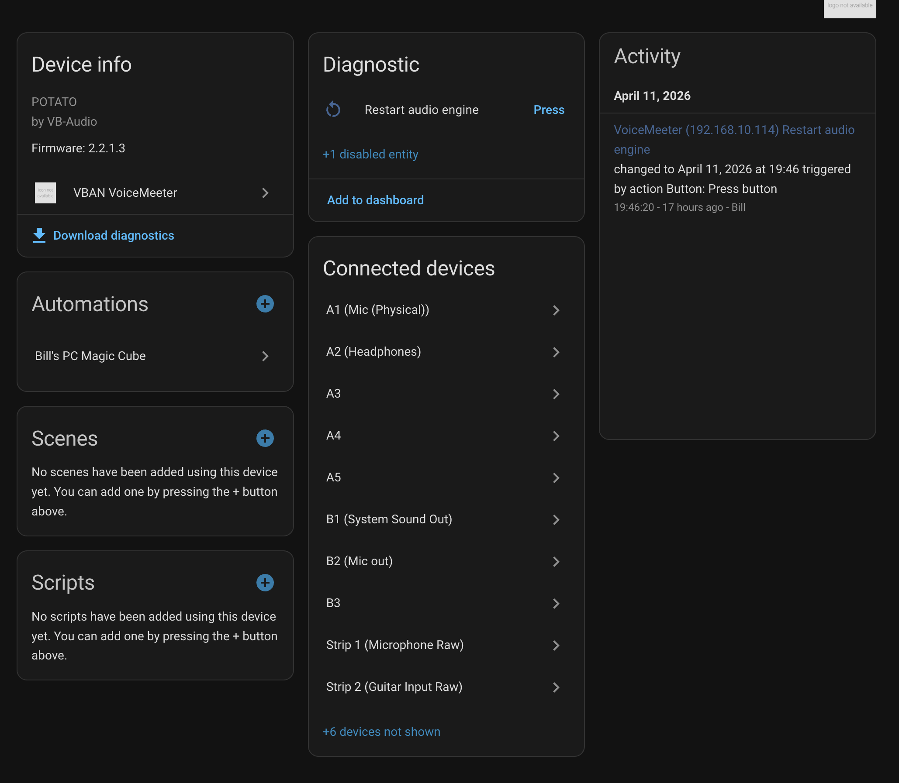
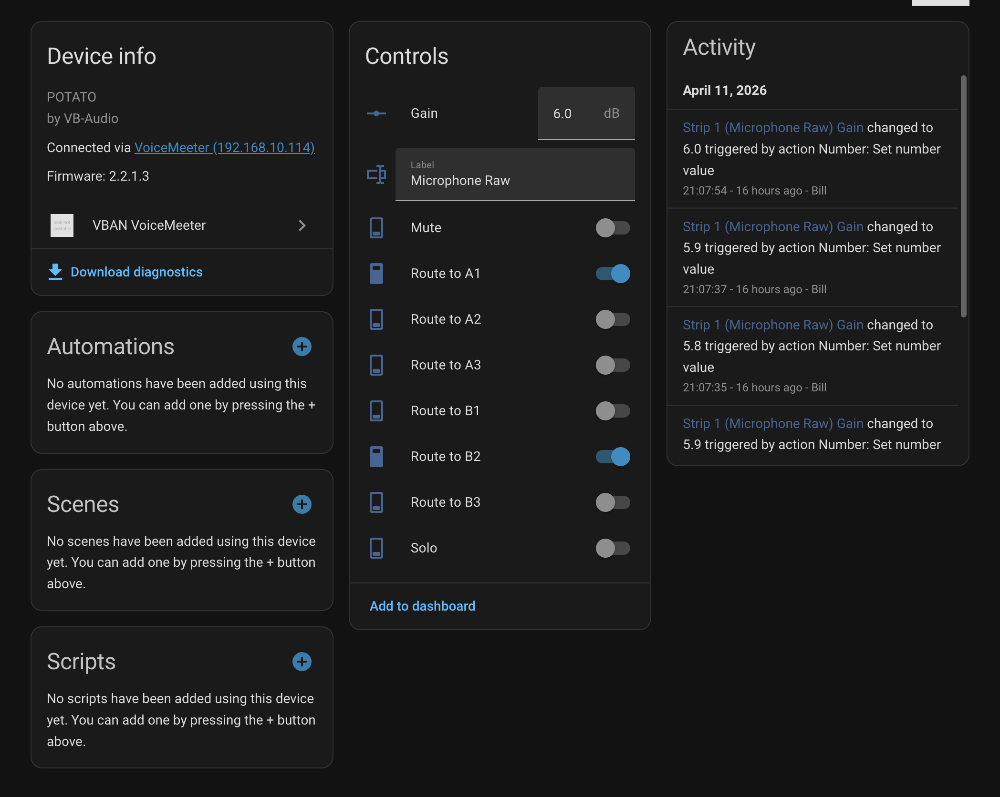

# Home Assistant VBAN VoiceMeeter Integration

This integration allows you to control VoiceMeeter via VBAN from Home Assistant.

## Screenshots

### Top Level Device

The top-level device view provides a comprehensive overview of all your VoiceMeeter strips, buses, and global controls directly within Home Assistant. It's designed to give you a quick "at-a-glance" status of your entire audio setup.

### Single Strip View

The single strip view offers precise, ergonomic control over individual inputs and outputs. Adjust gain levels with sliders and toggle solo or mute states with a single tap, making it ideal for real-time audio management.

## Features

- Control Strip/Bus Mute and Solo
- Adjust Strip/Bus Gain
- Global commands (Restart Engine, Show Window)
- Dynamic updates via VBAN RT packets
